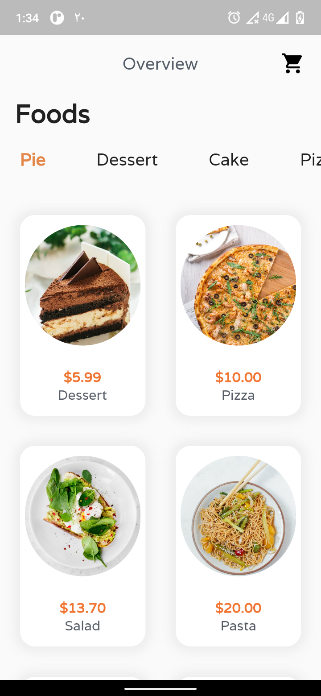
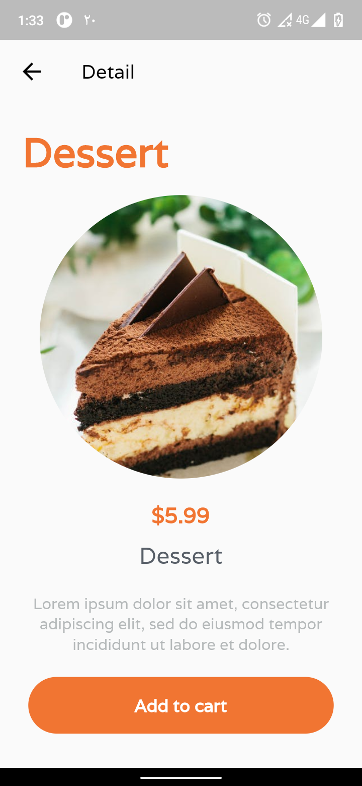
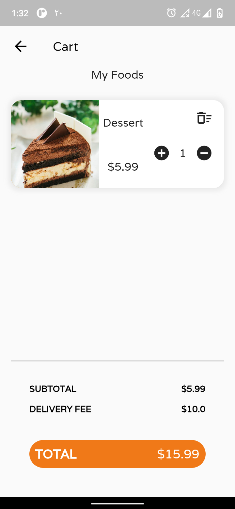
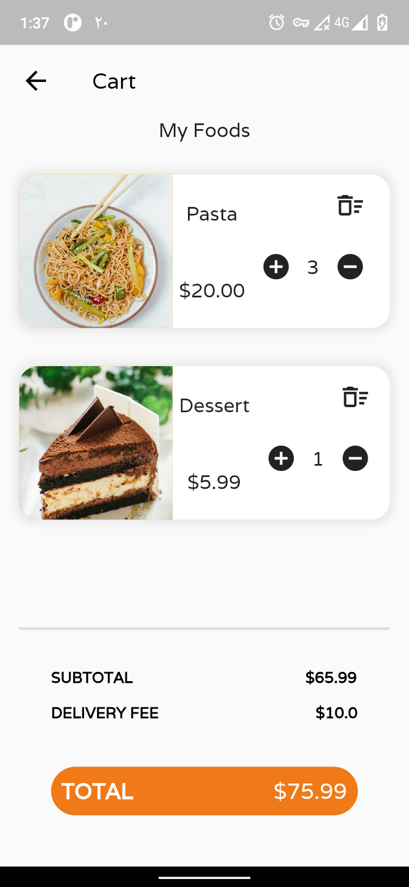
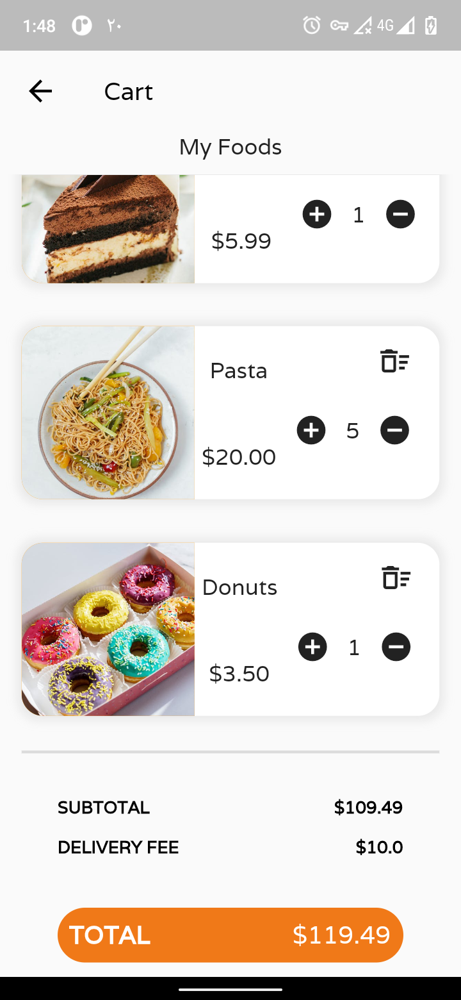

# oline_shop_app

The aplication is a small online shop app with a product overview page, a product detail page and a shopping basket. 
It makes use of freezed and the flutter_bloc package for state management, following the clean architecture pattern.

  
  
  
  
  

# App Overview
  
This application is composed by 3 main sections: overview, detail and cart screens.
The first one shows a list of available fake products. The second one displays the details
about each product and the final one shows the subtotal, total amount and functions like
increase, decrease and remove product.

# Supported State Management Solutions
  
- [Flutter Bloc 8.0.1 (latest version)](https://pub.dev/packages/flutter_bloc)
- [Cubit](https://pub.dev/packages/flutter_bloc)
  
# Packages 

- [Freezed](https://pub.dev/packages/freezed)
- [Modular](https://pub.dev/packages/flutter_modular)
- [Freezed Annotation](https://pub.dev/packages/freezed_annotation)
- [Google Fonts](https://pub.dev/packages/google_fonts)
- [Json Serializable](https://pub.dev/packages/json_serializable)

# Future Roadmap

- Add more screens
- Add more features
- Add animations
- Polish the UI
- Integrate a remote storage 

# scource
  
  - [Online Shop App with Clean Architecture, Bloc and Freezed](https://github.com/cindistar/small-online-shop-app-with-bloc-and-clean-arquitecture.git)
